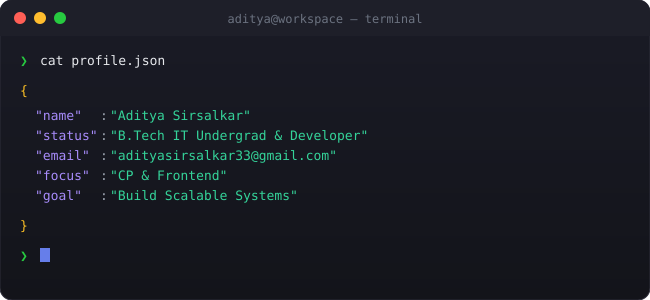

<h1 align="center">
  
</h1>

  
  
  

  

 
---

## 🚀 About Me

I am a **Software Engineering student** at **IIIT Allahabad** with a strong foundation in algorithmic problem solving and high-performance web architecture.

* 👨‍💻 **Competitive Coder:** Solved **800+ problems** across platforms. **Knight** on LeetCode (Top 5%), **Specialist** on Codeforces.
* 🧠 **Core Interests:** Data Structures, System Design, and **WebAssembly** optimizations.
* ♟️ **Community Leader:** Organized hybrid chess tournaments for **100+ participants**.
* 🏆 **Background:** Secured **AIR 5183** (99.68%ile) in JEE Main 2024.

 

---

## 💻 Tech Stack

**Languages**
 

**Full Stack & AI**
 

**Tools & Databases**
 

---

## 📌 Featured Projects

| Project | Tech Stack | Description |
| :--- | :--- | :--- |
| 🏥 **[Swasthya-Setu](https://github.com/AdityaSirsalkar001/Swasthya_Setu)** | `React` `Node.js` `Gemini` | **Integrated Hospital-Patient Bridge.** Reduced scheduling time by **40%**. Integrated **Google Gemini AI** for intelligent symptom processing. |
| 🕸️ **[Pathfinding Visualizer](https://github.com/AdityaSirsalkar001/Pathfinding_Visualizer)** | `C++` `Wasm` `React` | **High-Performance Tool.** Engineered using **WebAssembly** for **10x faster execution** (sub-50ms). |
| ⚡ **[FocusFlow](https://github.com/AdityaSirsalkar001/FocusFlow)** | `React` `Tailwind` | **Productivity Web App.** Handles 50+ concurrent tasks with **zero latency**. |

---

## 📊 Coding Statistics

  
  

---

## 📈 GitHub Analytics

 

## 🏆 GitHub Achievements

  

---

  

